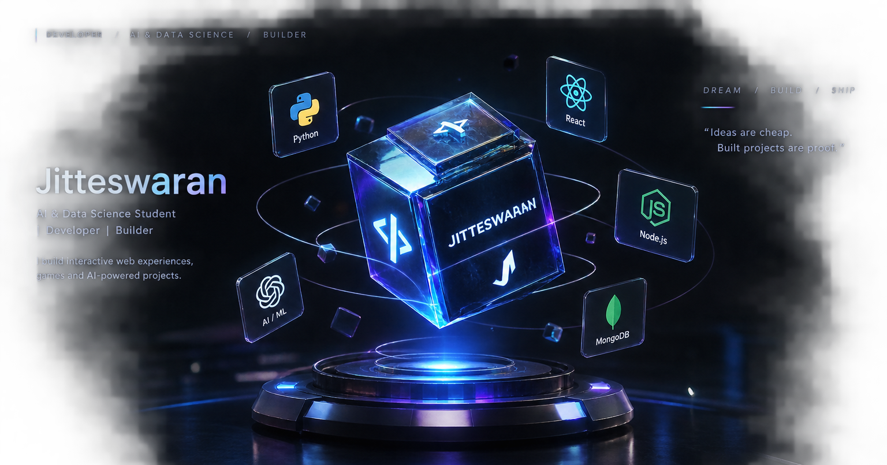

<div align="center">

<a href="https://github.com/jitteswaran">
  
</a>

<br><br>

# JITTESWARAN

### AI & Data Science Student • Developer • Builder

Building interactive web experiences, games and AI-powered projects.

<br>

<a href="https://github.com/jitteswaran">
  
</a>
<a href="https://www.linkedin.com/in/jitteswaran-t-4730b0431">
  
</a>
<a href="https://www.instagram.com/build_with_jerry">
  
</a>

</div>

---

## ⚡ ABOUT

> Developer focused on turning ideas into real, usable projects.

- 🎨 Interactive Web Experiences
- 🤖 AI & Computer Vision
- 🎮 Games & Experimental Projects
- 💻 Full-Stack Development
- 🚀 Learning by building and shipping

---

## 🧠 TECH CORE

<div align="center">

### Languages


### Frontend


### Backend & Database


### Tools


</div>

---

## 🚀 PROJECT NODES

<details>
<summary><b>🎨 Imposter Ink</b></summary>

<br>

A multiplayer drawing and imposter-detection game where players draw clues while trying to identify the hidden imposter.

**Tech Stack**

JavaScript • Node.js • Express • Canvas

**Status:** Completed

</details>

<br>

<details>
<summary><b>🤟 SignMate AI</b></summary>

<br>

A sign-language learning application using camera-based hand tracking and computer vision.

**Tech Stack**

JavaScript • MediaPipe • Computer Vision

**Status:** Completed

</details>

<br>

<details>
<summary><b>⌨️ Spell Rush</b></summary>

<br>

An interactive spelling-improvement game built around fast-paced rounds, scoring and progression.

**Tech Stack**

HTML • CSS • JavaScript

**Status:** Completed

</details>

<br>

<details>
<summary><b>🛒 Sunrise Maligai</b></summary>

<br>

A grocery management system designed for inventory tracking and billing.

**Tech Stack**

React • Node.js • MongoDB

**Status:** Building

</details>

<br>

<details>
<summary><b>🌌 3D Interactive Web Experience</b></summary>

<br>

An experimental portfolio project focused on immersive 3D interaction directly in the browser.

**Tech Stack**

Web • 3D • JavaScript

**Status:** Planned

</details>

---

## 📂 PROJECT ARCHIVE

| Project | Type | Status |
|---|---|---|
| 🎨 Imposter Ink | Multiplayer Game | ✅ Completed |
| 🤟 SignMate AI | Computer Vision | ✅ Completed |
| ⌨️ Spell Rush | Web Game | ✅ Completed |
| 🩸 BloodConnect | Web Application | ✅ Completed |
| 🏥 Hospital Management System | Web Application | ✅ Completed |
| 👤 Who Am I | Web Application | ✅ Completed |
| 🛒 Sunrise Maligai | Management System | 🔨 Building |
| 🌌 3D Interactive Web | Portfolio Experience | 🧪 Planned |

---

## 🌌 CURRENT BUILD

<div align="center">

### 3D INTERACTIVE WEB EXPERIENCE

**Turning a portfolio into an experience.**

```text
STATUS   →  PLANNING
MODE     →  EXPERIMENTAL
TARGET   →  PORTFOLIO
FOCUS    →  3D + INTERACTION
```

📚 LEARNING MATRIX
```

Web Development        ███████████████░░░
JavaScript             ███████████████░░░
React                  ████████████░░░░░░
Node.js                ███████████░░░░░░░
MongoDB                ██████████░░░░░░░░
Computer Vision        █████████░░░░░░░░░
AI / ML                ████████░░░░░░░░░░
3D Web                 █████░░░░░░░░░░░░░
```

🔄 DEVELOPMENT LOOP
<div align="center">

```text
IDEA
  ↓
DESIGN
  ↓
BUILD
  ↓
DEBUG
  ↓
POLISH
  ↓
SHIP
  ↓
REPEAT
</div>
```

🎯 2026 MISSION

```text
[✓] Build real projects
[✓] Learn by shipping
[✓] Publish projects
[✓] Build AI-powered experiences
[ ] Go deeper into 3D
[ ] Build an interactive developer portfolio
[ ] Create bigger real-world applications
```
🖥️ GITHUB TERMINAL
<div align="center">
  
```text
┌───────────────────────────────────────────────┐
│                                               │
│   USER       : JITTESWARAN                   │
│   ROLE       : DEVELOPER                     │
│   MODE       : BUILD                         │
│   SYSTEM     : ONLINE                        │
│                                               │
│   DREAM      → BUILD                         │
│   BUILD      → DEBUG                         │
│   DEBUG      → POLISH                        │
│   POLISH     → SHIP                          │
│                                               │
│   > system ready...                          │
│                                               │
└───────────────────────────────────────────────┘
</div>
```
🔗 CONNECT
<div align="center"> <a href="https://github.com/jitteswaran">  </a> <a href="https://www.linkedin.com/in/jitteswaran-t-4730b0431">  </a> <a href="https://www.instagram.com/build_with_jerry">  </a>

<br><br>

Building ideas into experiences.

</div>

<div align="center">

<sub>© 2026 Jitteswaran • Built with curiosity and code.</sub>

</div> 
